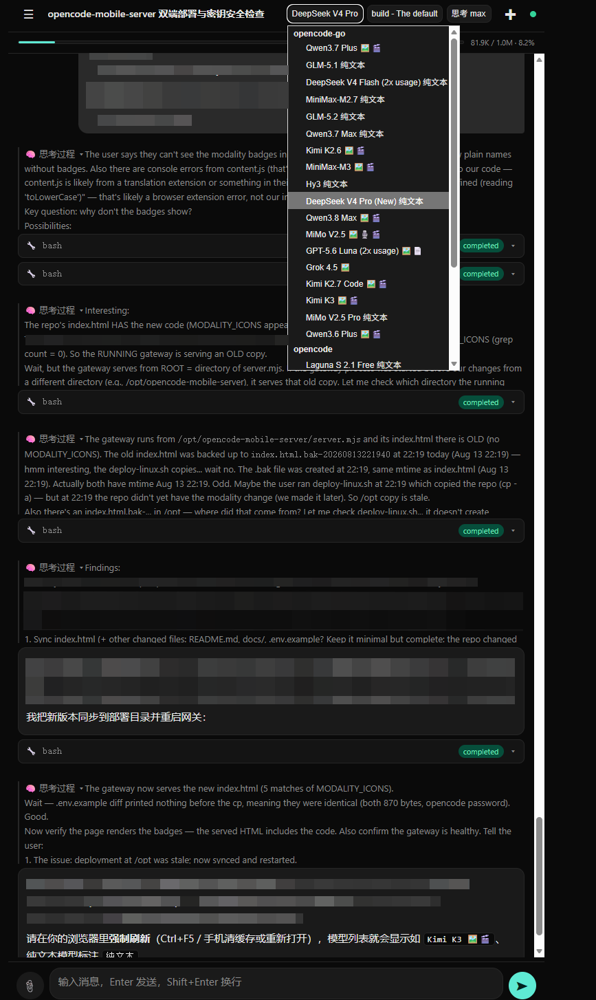
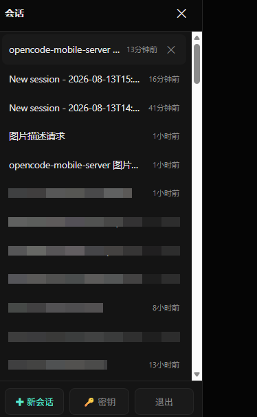

# OpenCode Mobile Server

这是一个面向手机浏览器、可自托管到服务器或局域网的 OpenCode Web 客户端与部署网关，提供会话列表、流式回复、Markdown、工具调用展示、文件上传和移动端抽屉式导航。它属于 OpenCode 生态，既可以在 Windows 电脑上启动供手机通过局域网访问，也可以部署到 Linux 服务器并通过域名对外提供 HTTPS 服务。

本文档提供完整的中文说明和完整的 English documentation，英文文档位于下方。

## 界面预览 / Screenshots

| 主界面 | 会话列表（点开 ☰ 菜单） |
| :-: | :-: |
|  |  |

## 中文文档

## 功能

- 移动端优先的深色界面，支持手机安全区域。
- 会话切换、历史消息缓存和游标分页加载。
- 通过 OpenCode 事件接口实时显示生成内容；SSE 不可用时使用轮询同步状态和消息。
- SSE 兼容 LF/CRLF 分隔符，生成中的文本和思考内容会逐块显示。
- 支持选择模型、Agent 和思考强度（variant），并按模型保存选择；切换会话时模型选择器会自动同步到该会话当前实际使用的模型。模型列表会标注各模型支持的模态（🖼️ 图像、🎙️ 音频、🎬 视频、📄 文档），纯文本模型显示“纯文本”。
- 支持显示当前会话的上下文用量和模型上下文上限。
- 支持处理 OpenCode 的 AI 追问，可单选、多选、自定义回答或跳过。
- 支持单次请求最多 20 MB 的文件附件，可把文件或图片直接拖进输入框。
- 侧边栏直接管理各 provider 的 API 密钥，切换后自动重启 OpenCode 服务生效。
- 支持停止生成、重试状态提示、代码块复制和移动端 PWA 安装入口。
- 前端无需构建，运行时无需安装 npm 依赖。
- Node 网关同时提供静态页面，并代理 `/opencode/api/*` 到 OpenCode 服务。

## 工作原理

```text
手机或电脑浏览器
  -> /opencode/                 手机 Web 页面
  -> /opencode/api/*            Node 网关
                                  -> 127.0.0.1:4096 OpenCode 服务
```

本项目是 OpenCode 的客户端和网关，不包含 OpenCode CLI 本身。使用前需要单独安装 OpenCode，并确保 `opencode serve` 可以运行。

新版客户端依赖 OpenCode 的 provider、Agent、事件、问题和游标分页接口。若 OpenCode 版本过旧，可能出现模型列表为空、AI 追问无法显示或“加载更早消息”失败；请使用与当前 OpenCode API 匹配的版本。

## Linux 目录约定

Linux 服务器只保留一份 Web 项目：

```text
/opt/opencode-mobile-server/                 本项目源码、页面和 Node 网关
/etc/opencode-mobile-server/opencode.env    密码等运行配置
/root/.opencode/                              OpenCode CLI 本身
```

Nginx 只负责域名、HTTPS 和 `/opencode/` 反向代理，不再从 `/www/wwwroot` 复制或读取前端文件。这样 Windows 和 Linux 使用同一个项目目录结构，升级时只需要更新 `/opt/opencode-mobile-server`。项目提供的 Nginx 模板默认只监听 HTTP 80 端口，证书和 443 配置仍需单独完成。

## 默认密码和修改方式

新部署的默认密码是：

```text
opencode
```

对外网开放前必须修改密码。复制 `.env.example` 为 `.env`，修改下面的配置：

```dotenv
OPENCODE_SERVER_PASSWORD=请替换为随机长密码
```

网关和 OpenCode 服务必须使用同一个密码：

- Windows：修改项目根目录的 `.env`。
- Linux 服务器：修改 `/etc/opencode-mobile-server/opencode.env`。

手机页面会将输入的密码保存在浏览器本地存储中。改密码后，请点击页面里的“退出登录”重新输入；如果仍然失败，请清除该网站的本地存储中的 `oc_pwd`。

网关使用 Basic Auth 的密码部分校验访问密码，用户名不会用于授权。新版网关会先校验 `/opencode/api/*`，再转发给 OpenCode；OpenCode 服务仍必须使用相同密码。

## Windows 局域网部署

### 环境要求

- Windows 10 或更高版本。
- Node.js 18 或更高版本。
- 已安装 OpenCode，且命令行可以直接执行 `opencode`。

### 启动步骤

小白用户请先阅读完整的 [Windows 局域网访问指南](docs/WINDOWS-LAN-GUIDE.md)，其中解释了 `127.0.0.1`、`0.0.0.0` 和 `192.168.x.x` 的区别。

推荐直接双击下面的文件进行一键部署：

```text
scripts\deploy-windows.bat
```

它会检查 Node.js 和 OpenCode，自动创建 `.env`，启动 OpenCode 和 Web 网关，并打开本机页面。首次启动后请编辑项目根目录的 `.env` 修改密码，再重新运行脚本。

如果 4096 端口已有 OpenCode 服务，脚本会复用它，通常只需要启动窗口和 Web 网关窗口；如果脚本需要新启动 OpenCode，可能会额外出现一个后端窗口。如果后端启动失败，Web 网关 PowerShell 窗口会保留错误信息，不要只看自动关闭的后端窗口。

在 PowerShell 中进入项目目录：

```powershell
Copy-Item .env.example .env
notepad .env
powershell -ExecutionPolicy Bypass -File .\scripts\start-windows.ps1
```

脚本会启动：

- OpenCode API：`127.0.0.1:4096`，只允许本机访问。
- Web 网关：`0.0.0.0:8787`，允许局域网访问。

使用 `ipconfig` 查看 Windows 的局域网 IP，例如 `192.168.1.100`，然后在手机浏览器打开：

```text
http://192.168.1.100:8787/opencode/
```

如果 Windows 防火墙拦截 8787 端口，请使用管理员 PowerShell 执行：

```powershell
New-NetFirewallRule -DisplayName "OpenCode Mobile Server" -Direction Inbound -Protocol TCP -LocalPort 8787 -Action Allow
```

如果 OpenCode 已经作为其他服务运行，只启动 Web 网关：

```powershell
powershell -ExecutionPolicy Bypass -File .\scripts\start-windows.ps1 -SkipBackend
```

## Linux 服务器和域名部署

### 环境要求

- Linux、systemd 和 Nginx。
- Node.js 18 或更高版本。
- OpenCode 已安装。示例服务文件默认使用 `/usr/local/bin/opencode`，请按实际安装路径修改。
- 域名的 DNS `A` 或 `AAAA` 记录已经指向服务器。

### 安装 Web 网关

将项目放到 `/opt/opencode-mobile-server`，创建服务器配置文件：

```bash
sudo mkdir -p /opt/opencode-mobile-server
sudo cp -a . /opt/opencode-mobile-server/
sudo mkdir -p /etc/opencode-mobile-server
sudo cp /opt/opencode-mobile-server/.env.example /etc/opencode-mobile-server/opencode.env
sudo chmod 600 /etc/opencode-mobile-server/opencode.env
sudo editor /etc/opencode-mobile-server/opencode.env
NODE_BIN="$(command -v node)"
sudo sed -e "s|__INSTALL_DIR__|/opt/opencode-mobile-server|g" -e "s|__NODE_BIN__|${NODE_BIN}|g" /opt/opencode-mobile-server/scripts/opencode-mobile-server.service | sudo tee /etc/systemd/system/opencode-mobile-server.service >/dev/null
sudo systemctl daemon-reload
sudo systemctl enable --now opencode-mobile-server.service
```

推荐使用下面的 Linux 一键部署脚本。它会安装 Web 网关和 OpenCode systemd 服务；传入域名后还会生成并检查 Nginx 配置：

```bash
sudo bash scripts/deploy-linux.sh example.com
```

如果只需要安装服务、不自动写入 Nginx：

```bash
sudo bash scripts/deploy-linux.sh --skip-nginx
```

如果 OpenCode 不在 PATH 中，可以指定二进制路径：

```bash
sudo OPENCODE_BIN=/path/to/opencode bash scripts/deploy-linux.sh example.com
```

脚本还支持以下选项：

- `--domain=example.com`：用选项形式指定域名。
- `--skip-nginx`：只安装两个 systemd 服务，不写入 Nginx 配置。
- `INSTALL_DIR=/srv/opencode-mobile-server`：修改项目安装目录。

Linux 网关应只监听回环地址。脚本生成的 systemd 单元会设置 `OPENCODE_WEB_HOST=127.0.0.1`；部署后可用下面的命令确认 8787 没有直接暴露到公网：

```bash
sudo ss -ltnp | grep ':8787'
```

如果手动修改了 systemd 单元或环境文件，请保留 `OPENCODE_WEB_HOST=127.0.0.1`，再执行 `sudo systemctl daemon-reload && sudo systemctl restart opencode-mobile-server.service`。

### 安装 OpenCode API 服务

OpenCode 服务必须使用和 `/etc/opencode-mobile-server/opencode.env` 相同的密码。项目提供了参考服务文件：

```bash
sudo cp /opt/opencode-mobile-server/scripts/opencode-server.service /etc/systemd/system/opencode-server.service
sudo editor /etc/systemd/system/opencode-server.service
sudo systemctl daemon-reload
sudo systemctl enable --now opencode-server.service
```

安装前请检查 `ExecStart` 中的 OpenCode 路径。服务器上的 OpenCode API 默认只监听 `127.0.0.1:4096`，不要直接暴露 4096 端口。

### 配置域名访问

生成或复制 `scripts/nginx-opencode-mobile-server.conf.example`，把 `__DOMAIN__` 替换为实际域名。模板完成 Nginx 到本机网关的 HTTP 反向代理，初始访问地址是：

```text
http://example.com/opencode/
```

检查并重新加载 Nginx：

```bash
sudo nginx -t
sudo systemctl reload nginx
```

如果域名已经有 Nginx `server` 块，不要创建重复的 `server`，只把模板中的 `/opencode` 两个 `location` 复制到现有配置中。公网使用时必须另外配置 HTTPS、443 监听和证书；完成后再使用：

```text
https://example.com/opencode/
```

可以使用 Certbot 或服务器已有的证书管理工具配置 HTTPS。不要把 4096 端口或未经 HTTPS 保护的 8787 端口直接暴露到公网。

## 手动运行

复制并编辑 `.env` 后执行：

```bash
npm start
```

默认访问地址：

```text
http://127.0.0.1:8787/opencode/
```

本项目没有运行时 npm 依赖，不需要执行 `npm install`。

`npm run start:lan` 只是 `npm start` 的别名，不会自动修改监听地址；是否允许局域网访问由 `OPENCODE_WEB_HOST` 决定。

## 配置项

| 配置项 | 默认值 | 说明 |
| --- | --- | --- |
| `OPENCODE_SERVER_PASSWORD` | `opencode` | OpenCode Basic Auth 密码，必须修改 |
| `OPENCODE_API_URL` | `http://127.0.0.1:4096` | OpenCode 服务地址 |
| `OPENCODE_WEB_HOST` | `127.0.0.1` | Web 网关监听地址；Windows 脚本会使用 `0.0.0.0` |
| `OPENCODE_WEB_PORT` | `8787` | Web 网关端口 |
| `OPENCODE_SERVICE_NAME` | `opencode-server.service` | 密钥切换后自动重启的 OpenCode systemd 服务；设为 `none` 关闭自动重启 |
| `OPENCODE_AUTH_FILE` | 自动检测 | OpenCode 的 `auth.json` 路径（Linux 为 `~/.local/share/opencode/auth.json`，macOS 为 `~/Library/Application Support/opencode/auth.json`，Windows 为 `%LOCALAPPDATA%\opencode\auth.json`） |
| `OPENCODE_AUTH_KEYS_FILE` | 项目目录 `.auth-keys.json` | 网关保存全部密钥的本地文件（建议 Linux 服务器放到 `/etc/opencode-mobile-server/`） |

浏览器 API 路径固定为 `/opencode/api`，因此同一份前端代码既可以用于 Windows 局域网，也可以用于服务器域名路径，不需要重新构建。

`OPENCODE_AUTH_FILE`、`OPENCODE_AUTH_KEYS_FILE` 建议使用绝对路径。Linux 使用 `XDG_DATA_HOME` 时，自动检测的 OpenCode 密钥文件为 `$XDG_DATA_HOME/opencode/auth.json`。

## 新版客户端功能

顶部可以选择 OpenCode 返回的模型、Agent 和思考强度。每个模型后面会显示它支持的输入模态（图像、音频、视频、文档）以及输出模态（如“生成🖼️”表示可以生成图像）；没有额外模态的模型显示“纯文本”。模态信息来自 OpenCode 的 provider 配置，OpenCode 版本过旧时可能不显示。思考强度只在当前模型支持推理时显示，可用值由模型配置决定，常见值包括 `none`、`minimal`、`low`、`medium`、`high`、`max` 和 `xhigh`。

当前模型提供上下文上限时，消息区上方会显示已用 tokens、上限和百分比；达到 70% 或 90% 时会改变提示颜色。它是估算提示，不会替代 OpenCode 的实际限制。

当 Agent 通过 OpenCode `question.asked` 事件提问时，页面会显示问题面板，支持单选、多选、自定义文本和跳过。回答或跳过后，任务会继续执行；切换会话时不会显示其他会话的问题。客户端同时兼容新版 OpenCode 下发的 `question.v2.*` 和 `permission.v2.*` 事件名。

生成中的消息通过 SSE 增量显示。连接中断时页面会自动重连，并在页面可见时轮询会话状态和最近消息作为兜底。顶部的停止按钮会调用 OpenCode 的 abort 接口。

回复使用轻量 Markdown，支持标题、粗体、斜体、删除线、行内代码、代码块、引用、无序列表、链接、简单表格和分隔线；不提供完整 Markdown 解析或代码高亮。附件会转成 Data URL 后发送，单次消息选择的文件原始大小合计最多 20 MB，支持直接把文件或图片拖进输入框；仅带附件也可以直接发送。反向代理的请求体限制应大于 20 MB，项目 Nginx 模板使用 50 MB。

页面提供 PWA 安装清单，但不包含离线缓存。密码、当前会话、模型、Agent 和思考强度保存在当前浏览器的本地存储中；消息内容主要在页面内存中缓存，刷新后会重新从 OpenCode 加载。

## 管理 API 密钥

侧边栏的“🔑 密钥”面板可以保存、切换和删除各 provider（如 opencode-go）的 API 密钥，不再需要登录服务器执行 `opencode auth login`。

- **保存并切换**：新密钥会写入 OpenCode 的 `auth.json` 并成为当前生效密钥。Linux 上网关会自动重启 `OPENCODE_SERVICE_NAME` 指定的服务让新密钥立即生效（约几秒钟），页面会自动重连；Windows 或自动重启不可用时，请手动重启 OpenCode 后刷新页面。若在服务器终端直接运行 `opencode`，也需要重启该终端会话。
- **切换**：可以在已保存的多个密钥之间来回切换。
- **删除**：只从保存列表中移除，不影响当前生效密钥。
- 密钥保存在 `OPENCODE_AUTH_KEYS_FILE` 指定的文件中（默认项目目录 `.auth-keys.json`，已加入 `.gitignore`），不会写入仓库；写入 `auth.json` 前会保留一份 `auth.json.bak` 备份。接口只返回掩码和密钥元数据，不会把原始密钥返回给页面。
- Linux 建议把 `OPENCODE_AUTH_KEYS_FILE` 放在 `/etc/opencode-mobile-server/`，并限制为仅服务用户可读；不要把 `.auth-keys.json`、`auth.json` 或 `auth.json.bak` 放入 Git 仓库或备份到公开位置。

> 注意：OpenCode 服务在启动时读取密钥并缓存，所以修改密钥后必须重启服务才会生效，这就是保存/切换后网关自动执行重启的原因。

## 升级新版

升级时请同时替换 `index.html`、`server.mjs`、`package.json` 和 `scripts/` 下的部署文件，不要只替换页面。Windows 保留项目根目录的 `.env`；Linux 保留 `/etc/opencode-mobile-server/opencode.env` 和密钥文件。替换完成后重启 Web 网关和 OpenCode 服务：

```bash
sudo systemctl restart opencode-server.service opencode-mobile-server.service
```

如果使用 Windows，关闭旧的 PowerShell 网关窗口后重新运行 `scripts\deploy-windows.bat`，或运行 `scripts\start-windows.ps1`。浏览器仍显示旧页面时，先强制刷新；模型、Agent 或思考强度异常时，可清理浏览器本地存储中的 `oc_model`、`oc_agent` 和 `oc_variants` 后重新打开页面。

## 故障排查

### 一直显示 401 或反复出现登录页面

检查 `.env`、`/etc/opencode-mobile-server/opencode.env` 和 `opencode serve` 使用的密码是否一致。然后退出登录，或清除网站本地存储中的 `oc_pwd` 后重新登录。

如果浏览器弹出标题为 `Secure Area` 的用户名和密码对话框，那是旧网关透传了 OpenCode 的 `WWW-Authenticate` 响应头，触发了浏览器原生 Basic Auth。当前网关会隐藏这个响应头，只显示页面自己的登录框；更新页面后请刷新浏览器缓存。

### `/opencode/api` 返回 502

Node 网关无法连接 `OPENCODE_API_URL`。检查 OpenCode 是否监听 4096 端口，以及配置文件中的地址是否正确。

### 回复要等生成完成后才出现

请刷新页面获取最新的 `index.html`。客户端会按 SSE 标准同时解析 LF 和 CRLF 事件分隔符；网关和 Nginx 也会对事件流关闭缓存和内容转换。如果仍然被缓存，请确认自定义 Nginx 配置包含 `proxy_buffering off` 和 `proxy_cache off`。

### 思考强度

顶部“思考”选择器会在当前模型支持推理时显示。它传递 OpenCode 的 `variant` 参数，常见选项包括 `none`、`minimal`、`low`、`medium`、`high`、`max` 和 `xhigh`；具体可用选项以模型和 OpenCode 版本为准。选择会按模型保存在浏览器本地。

### 页面能打开，但不是 `/opencode/`

请使用带结尾斜杠的完整路径。网关会自动将 `/` 和 `/opencode` 重定向到 `/opencode/`。

### 点击“加载更早消息”返回 400

新版客户端使用 OpenCode 分页接口返回的 `X-Next-Cursor` 游标。如果刚升级过，请刷新页面，避免浏览器继续使用旧的 `index.html` 缓存。

### 模型列表为空或 AI 追问不显示

确认 OpenCode 版本提供 `/config/providers`、`/agent`、`/question`、`/session/status` 和事件接口，并检查网关日志。升级页面后强制刷新；如果只有某个模型没有思考选择器，通常是该模型没有配置推理能力或 variants。

### 直接访问 API 没有登录页面

`/opencode/api/*` 是 API 地址，不是网页登录页。请求必须携带网关密码对应的 Basic Auth；浏览器应访问 `/opencode/`，由页面显示登录框。不要把 `OPENCODE_API_URL` 指向一个没有认证、却又可被公网访问的后端。

## 安全建议

- 默认密码只用于首次启动，外网部署前必须修改。
- 服务器上保持 4096 只监听回环地址。
- Linux 网关只监听 `127.0.0.1`，由 Nginx 负责公网入口；Windows 局域网使用 `0.0.0.0` 时只开放可信网络。
- 公网访问必须启用 HTTPS。
- 不要把 `.env`、`.auth-keys.json`、OpenCode `auth.json`、API 密钥或其他凭据提交到 GitHub，只提交 `.env.example`。
- 公网部署不要使用 `--skip-nginx` 后直接暴露 8787；先配置 HTTPS 和反向代理。

## English Documentation

### OpenCode Mobile Server

This is a self-hosted mobile web client and deployment gateway for the OpenCode ecosystem. It provides a session list, streaming replies, Markdown rendering, tool-call display, file uploads, and a mobile drawer navigation. You can run it on a Windows computer for phone access over your LAN, or deploy it to a Linux server and expose it with a domain over HTTPS.

### Features

- Mobile-first dark interface with safe-area support.
- Session switching with cached history and cursor-based pagination.
- Live generation updates through the OpenCode event API, with polling fallback when SSE is unavailable.
- Model, Agent, and per-model reasoning-variant selection; when you switch sessions the model selector follows the model actually in use by that session. The model list shows each model's supported modalities (🖼️ image, 🎙️ audio, 🎬 video, 📄 document); text-only models are labeled "纯文本".
- Context usage display when the current model reports a context limit.
- OpenCode AI question prompts with single-choice, multiple-choice, custom answers, and skip.
- File attachments up to 20 MB per request; files or images can be dropped straight onto the input box.
- Manage provider API keys from the drawer; the gateway restarts OpenCode so the new key takes effect.
- Stop-generation control, retry notifications, code-block copy, and a mobile PWA install entry point.
- No frontend build step and no runtime npm dependencies.
- A Node gateway serves the static page and proxies `/opencode/api/*` to OpenCode.

### How It Works

```text
Phone or desktop browser
  -> /opencode/                 mobile web page
  -> /opencode/api/*            Node gateway
                                  -> 127.0.0.1:4096 OpenCode server
```

This project is an OpenCode client and gateway. It does not include or replace the OpenCode CLI. Install OpenCode separately and make sure `opencode serve` is available.

The current client expects OpenCode provider, Agent, event, question, and cursor-pagination endpoints. With an older OpenCode API, the model list may be empty, AI questions may not appear, or loading older messages may fail. Use a version compatible with the current OpenCode API.

### Linux Directory Layout

Linux keeps one Web project directory:

```text
/opt/opencode-mobile-server/                 project files and Node gateway
/etc/opencode-mobile-server/opencode.env    password and runtime settings
/root/.opencode/                              OpenCode CLI itself
```

Nginx is responsible for the domain, HTTPS, and reverse-proxying `/opencode/`. It no longer serves a second frontend copy from `/www/wwwroot`. Windows and Linux therefore use the same project layout. The included Nginx template listens on HTTP port 80 only; certificates and port 443 still need to be configured separately.

### Default Password and Password Changes

The default password for a new installation is:

```text
opencode
```

Change it before exposing the service to the Internet. Copy `.env.example` to `.env` and edit:

```dotenv
OPENCODE_SERVER_PASSWORD=replace-with-a-random-long-password
```

The gateway and the OpenCode server must use the same password:

- Windows: edit `.env` in the project root.
- Linux server: edit `/etc/opencode-mobile-server/opencode.env`.

The mobile page stores the entered password in browser local storage. After changing the password, use the logout button to sign in again. If that does not work, clear the site's `oc_pwd` local-storage value.

The gateway validates the password portion of Basic Auth for every `/opencode/api/*` request before proxying it to OpenCode. The OpenCode service must still use the same password; the Basic Auth username is not used for authorization.

### Windows LAN Deployment

#### Requirements

- Windows 10 or newer.
- Node.js 18 or newer.
- OpenCode installed and available as the `opencode` command.

#### Start

For a beginner-friendly explanation of `127.0.0.1`, `0.0.0.0`, and `192.168.x.x`, read the full [Windows LAN Access Guide](docs/WINDOWS-LAN-GUIDE.md).

For a one-click Windows deployment, double-click:

```text
scripts\deploy-windows.bat
```

It checks Node.js and OpenCode, creates `.env` when needed, starts OpenCode and the web gateway, and opens the local page. Edit the project-root `.env` after the first run to change the password, then run the script again.

If OpenCode is already listening on port 4096, the script reuses it and normally only the launcher and web-gateway windows are needed. If the script starts OpenCode itself, an additional backend window may appear. If the backend fails, the web-gateway PowerShell window keeps the error message instead of hiding it in a closed window.

Open PowerShell in the project directory:

```powershell
Copy-Item .env.example .env
notepad .env
powershell -ExecutionPolicy Bypass -File .\scripts\start-windows.ps1
```

The script starts:

- OpenCode API: `127.0.0.1:4096`, accessible only from the Windows machine.
- Web gateway: `0.0.0.0:8787`, accessible from the LAN.

Run `ipconfig` to find the Windows LAN address. For example, if it is `192.168.1.100`, open this URL on your phone:

```text
http://192.168.1.100:8787/opencode/
```

If Windows Firewall blocks port 8787, run PowerShell as Administrator:

```powershell
New-NetFirewallRule -DisplayName "OpenCode Mobile Server" -Direction Inbound -Protocol TCP -LocalPort 8787 -Action Allow
```

If OpenCode is already running as a separate service, start only the web gateway:

```powershell
powershell -ExecutionPolicy Bypass -File .\scripts\start-windows.ps1 -SkipBackend
```

### Linux Server and Domain Deployment

#### Requirements

- Linux with systemd and Nginx.
- Node.js 18 or newer.
- OpenCode installed. The example service uses `/usr/local/bin/opencode`; adjust it to the actual path.
- An `A` or `AAAA` DNS record pointing your domain to the server.

#### Install the Web Gateway

Copy the project to `/opt/opencode-mobile-server` and create the server environment file:

```bash
sudo mkdir -p /opt/opencode-mobile-server
sudo cp -a . /opt/opencode-mobile-server/
sudo mkdir -p /etc/opencode-mobile-server
sudo cp /opt/opencode-mobile-server/.env.example /etc/opencode-mobile-server/opencode.env
sudo chmod 600 /etc/opencode-mobile-server/opencode.env
sudo editor /etc/opencode-mobile-server/opencode.env
NODE_BIN="$(command -v node)"
sudo sed -e "s|__INSTALL_DIR__|/opt/opencode-mobile-server|g" -e "s|__NODE_BIN__|${NODE_BIN}|g" /opt/opencode-mobile-server/scripts/opencode-mobile-server.service | sudo tee /etc/systemd/system/opencode-mobile-server.service >/dev/null
sudo systemctl daemon-reload
sudo systemctl enable --now opencode-mobile-server.service
```

For a one-click Linux deployment, run the following script. It installs the web gateway and OpenCode systemd services. When you pass a domain, it also generates and checks the Nginx configuration:

```bash
sudo bash scripts/deploy-linux.sh example.com
```

To install the services without writing an Nginx configuration:

```bash
sudo bash scripts/deploy-linux.sh --skip-nginx
```

If OpenCode is not in `PATH`, provide its binary path:

```bash
sudo OPENCODE_BIN=/path/to/opencode bash scripts/deploy-linux.sh example.com
```

The script also supports:

- `--domain=example.com` to provide the domain as an option.
- `--skip-nginx` to install only the two systemd services.
- `INSTALL_DIR=/srv/opencode-mobile-server` to change the installation directory.

The Linux gateway should bind only to the loopback address. The generated systemd unit sets `OPENCODE_WEB_HOST=127.0.0.1`. After deployment, verify that port 8787 is not exposed directly:

```bash
sudo ss -ltnp | grep ':8787'
```

If you edit the systemd unit or environment file, keep `OPENCODE_WEB_HOST=127.0.0.1`, then run `sudo systemctl daemon-reload && sudo systemctl restart opencode-mobile-server.service`.

#### Install the OpenCode API Service

The OpenCode service must use the same password as `/etc/opencode-mobile-server/opencode.env`. A reference service file is included:

```bash
sudo cp /opt/opencode-mobile-server/scripts/opencode-server.service /etc/systemd/system/opencode-server.service
sudo editor /etc/systemd/system/opencode-server.service
sudo systemctl daemon-reload
sudo systemctl enable --now opencode-server.service
```

Review the OpenCode path in `ExecStart` before installing the service. The OpenCode API should listen on `127.0.0.1:4096`; do not expose port 4096 directly to the Internet.

#### Configure the Domain

Use `scripts/nginx-opencode-mobile-server.conf.example` and replace `__DOMAIN__` with your actual domain. The template creates an HTTP reverse proxy to the local gateway. The initial URL is:

```text
http://example.com/opencode/
```

Test and reload Nginx:

```bash
sudo nginx -t
sudo systemctl reload nginx
```

If the domain already has an Nginx `server` block, do not create a duplicate one. Copy only the two `/opencode` locations from the template into the existing block. For public access, configure HTTPS, port 443, and a certificate separately with Certbot or your existing certificate manager. Then use:

```text
https://example.com/opencode/
```

Do not expose port 4096 or an unprotected port 8787 directly to the Internet.

### Manual Run

Copy and edit `.env`, then run:

```bash
npm start
```

The default local URL is:

```text
http://127.0.0.1:8787/opencode/
```

There are no runtime npm dependencies, so `npm install` is not required.

`npm run start:lan` is only an alias for `npm start`; it does not change the bind address. Set `OPENCODE_WEB_HOST` explicitly when LAN access is needed.

### Configuration

| Variable | Default | Description |
| --- | --- | --- |
| `OPENCODE_SERVER_PASSWORD` | `opencode` | OpenCode Basic Auth password; change it |
| `OPENCODE_API_URL` | `http://127.0.0.1:4096` | OpenCode server address |
| `OPENCODE_WEB_HOST` | `127.0.0.1` | Web gateway bind address; Windows uses `0.0.0.0` |
| `OPENCODE_WEB_PORT` | `8787` | Web gateway port |
| `OPENCODE_SERVICE_NAME` | `opencode-server.service` | systemd service restarted after a key switch; set to `none` to disable |
| `OPENCODE_AUTH_FILE` | auto-detected | Path to OpenCode's `auth.json` (Linux: `~/.local/share/opencode/auth.json`, macOS: `~/Library/Application Support/opencode/auth.json`, Windows: `%LOCALAPPDATA%\opencode\auth.json`) |
| `OPENCODE_AUTH_KEYS_FILE` | `<project>/.auth-keys.json` | Local file where the gateway keeps all saved keys (put it under `/etc/opencode-mobile-server/` on Linux servers) |

The browser API path is intentionally fixed to `/opencode/api`, so the same frontend works on Windows LAN and behind a domain path without rebuilding.

Use absolute paths for `OPENCODE_AUTH_FILE` and `OPENCODE_AUTH_KEYS_FILE` when possible. On Linux, automatic auth-file detection honors `XDG_DATA_HOME`.

### Current Client Features

The top bar can select the models, Agents, and reasoning variants returned by OpenCode. Each model name is followed by its input modalities (image, audio, video, document) and output modalities (e.g. "生成🖼️" means it can generate images); models without extra modalities show "纯文本". Modality info comes from the OpenCode provider configuration and may be absent with older OpenCode versions. The available variants depend on the model configuration and commonly include `none`, `minimal`, `low`, `medium`, `high`, `max`, and `xhigh`.

When the current model reports a context limit, the message area shows used tokens, the limit, and a percentage. The colors change at 70% and 90%. This is an estimate and does not replace OpenCode's own limit enforcement.

When an Agent sends an OpenCode `question.asked` event, the page shows a question panel with single-choice, multiple-choice, custom text, and skip actions. The task continues after an answer or skip. Questions from another session are not shown in the current session. The client also normalizes the `question.v2.*` and `permission.v2.*` event names used by newer OpenCode servers.

Messages stream through SSE. The page reconnects after a disconnect and polls session status and recent messages while visible as a fallback. The stop button calls OpenCode's abort endpoint.

Replies use lightweight Markdown: headings, bold, italics, strikethrough, inline code, code blocks, blockquotes, unordered lists, links, simple tables, and horizontal rules. It is not a full Markdown parser and does not provide syntax highlighting. Attachments are sent as Data URLs; the original files selected for one message may total at most 20 MB, and files or images can be dropped straight onto the input box; a message with only attachments can be sent directly. A reverse proxy should allow more than 20 MB for the encoded request; the included Nginx template allows 50 MB.

The page includes a PWA manifest but has no offline cache. The current browser stores the password, current session, model, Agent, and reasoning variant in local storage. Message history is primarily an in-memory cache and is loaded again from OpenCode after a refresh.

### Managing API Keys

The "🔑 Keys" panel in the drawer lets you save, switch, and delete provider (e.g. opencode-go) API keys from the browser — no need to log into the server and run `opencode auth login`.

- **Save & switch**: the new key is written to OpenCode's `auth.json` and becomes active. On Linux the gateway automatically restarts the service named by `OPENCODE_SERVICE_NAME` so the key takes effect within a few seconds, and the page reconnects. On Windows, or when auto-restart is unavailable, restart OpenCode manually and refresh the page. If you also run `opencode` in a server terminal, restart that session too.
- **Switch**: toggle between any saved keys at any time.
- **Delete**: only removes the key from the saved list; the active key is untouched.
- Keys live in the file pointed to by `OPENCODE_AUTH_KEYS_FILE` (default `.auth-keys.json` in the project root, gitignored), never in the repository. Before overwriting `auth.json` a `auth.json.bak` backup is kept. The API returns only masked values and metadata, not raw keys.
- On Linux, put `OPENCODE_AUTH_KEYS_FILE` under `/etc/opencode-mobile-server/` and restrict it to the service user. Do not commit or publicly back up `.auth-keys.json`, `auth.json`, or `auth.json.bak`.

> Note: the OpenCode server reads keys at startup and caches them, so a restart is required after a key change — that is why the gateway restarts the service after save/switch.

### Upgrading

Replace `index.html`, `server.mjs`, `package.json`, and the deployment files under `scripts/` together. Keep the Windows project `.env`, and keep `/etc/opencode-mobile-server/opencode.env` plus the key files on Linux. Restart both services after replacing the files:

```bash
sudo systemctl restart opencode-server.service opencode-mobile-server.service
```

On Windows, close the old PowerShell gateway window and run `scripts\deploy-windows.bat` again, or run `scripts\start-windows.ps1`. If the browser still shows the old page, hard-refresh it. If model, Agent, or variant selection is inconsistent, clear `oc_model`, `oc_agent`, and `oc_variants` from browser local storage and reopen the page.

### Troubleshooting

#### Repeated 401 responses or login screen

Check that the password in `.env`, `/etc/opencode-mobile-server/opencode.env`, and `opencode serve` is identical. Log out, or clear the site's `oc_pwd` local-storage value, and sign in again.

If the browser shows a `Secure Area` username/password dialog, an older gateway exposed OpenCode's `WWW-Authenticate` header and triggered the browser's native Basic Auth prompt. The current gateway hides that header and shows only the web page login form. Refresh the page after upgrading.

#### 502 from `/opencode/api`

The Node gateway cannot reach `OPENCODE_API_URL`. Check that OpenCode is listening on port 4096 and that the address in `.env` is correct.

#### Page is not available at `/opencode/`

Use the complete path with the trailing slash. The gateway redirects `/` and `/opencode` to `/opencode/`.

#### Loading older messages returns 400

The current client uses the `X-Next-Cursor` cursor returned by OpenCode's paginated message API. After an upgrade, refresh the page so the browser does not keep using an old `index.html`.

#### Empty model list or missing AI questions

Confirm that the OpenCode version provides `/config/providers`, `/agent`, `/question`, `/session/status`, and the event API. Check the gateway log and hard-refresh after upgrading. If only one model lacks the reasoning selector, that model likely has no reasoning capability or variants configured.

#### Direct API access does not show a login page

`/opencode/api/*` is an API path, not the web login page. Requests must include Basic Auth with the gateway password. Open `/opencode/` in a browser to use the page login form. Do not point `OPENCODE_API_URL` at an unauthenticated backend that is reachable from the Internet.

### Security Recommendations

- The default password is for first-run convenience only. Change it before Internet access.
- Keep port 4096 bound to the loopback address on servers.
- Bind the Linux gateway to `127.0.0.1` and use Nginx as the public entry point; when Windows uses `0.0.0.0`, allow only trusted LAN access.
- Enable HTTPS for any public deployment.
- Do not commit `.env`, `.auth-keys.json`, OpenCode `auth.json`, API keys, or other credentials to GitHub. Commit only `.env.example`.
- Do not expose port 8787 directly after using `--skip-nginx`; configure HTTPS and a reverse proxy first.

### License

MIT License. See `LICENSE`.
